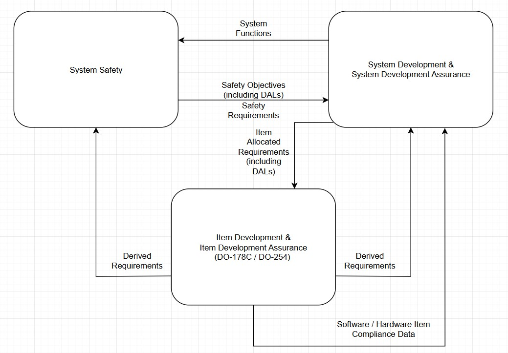

# Development Assurance Overview

## Definition

Development Assurance encompasses the planned and systematic activities that provide confidence that a product or system meets its requirements and is fit for its intended use. In aviation software, development assurance refers to the processes, methods, and tools used to ensure that software systems meet their safety and functional requirements.

*Development Assurance Relationship Diagram showing the connections between standards, processes, and artifacts*

## Key Standards

### DO-178C

**DO-178C** (Software Considerations in Airborne Systems and Equipment Certification) is the primary standard for aviation software development assurance. It provides:

- Guidelines for the production of software for airborne systems
- Objectives for software life cycle processes
- Description of activities and design considerations for achieving those objectives
- Descriptions of the evidence that indicates the objectives have been satisfied

### DO-254

**DO-254** (Design Assurance Guidance for Airborne Electronic Hardware) is the companion standard to DO-178C for hardware development. Many systems require compliance with both standards for system-level assurance.

### ARP4754A

**ARP4754A** (Guidelines for Development of Civil Aircraft and Systems) addresses development assurance at the aircraft and system level, providing the context for both DO-178C and DO-254.

## Development Assurance Levels (DALs)

Software and hardware components are assigned Development Assurance Levels based on the potential impact of their failure:

| Level | Failure Condition | Probability | Example |
|-------|-------------------|-------------|---------|
| A     | Catastrophic      | < 10^-9     | Flight control systems |
| B     | Hazardous         | < 10^-7     | Primary navigation systems |
| C     | Major             | < 10^-5     | Secondary flight displays |
| D     | Minor             | < 10^-3     | Maintenance systems |
| E     | No Effect         | N/A         | Entertainment systems |

## Key Processes

### Planning

Development assurance begins with comprehensive planning:

- **Plan for Software Aspects of Certification (PSAC)**: Defines compliance approach
- **Software Development Plan (SDP)**: Outlines development processes
- **Software Verification Plan (SVP)**: Describes verification activities
- **Software Configuration Management Plan (SCMP)**: Defines configuration control
- **Software Quality Assurance Plan (SQAP)**: Establishes quality processes

### Requirements Management

Requirements form the foundation of development assurance:

1. **Capture**: Documenting complete and unambiguous requirements
2. **Traceability**: Linking requirements through all lifecycle phases
3. **Verification**: Ensuring requirements are testable and verified
4. **Change Management**: Controlling and assessing requirement changes

### Design Assurance

Design activities include:

- **Architecture Definition**: Establishing system structure
- **Detailed Design**: Developing component specifications
- **Design Reviews**: Formal evaluation of design artifacts
- **Safety Analysis**: Assessing design for safety considerations

### Implementation

Code development with assurance considerations:

- **Coding Standards**: Following established guidelines
- **Static Analysis**: Automated code checking
- **Peer Reviews**: Manual code inspection
- **Traceability**: Linking code to design elements

### Verification

Comprehensive verification includes:

- **Requirements-Based Testing**: Verifying all requirements are met
- **Structural Coverage Analysis**: Ensuring code is thoroughly exercised
  - Statement Coverage (Level C+)
  - Decision Coverage (Level B+)
  - [MC/DC Coverage](/wiki/mc-dc-coverage/) (Level A)
- **Robustness Testing**: Evaluating behavior under abnormal conditions
- **Integration Testing**: Verifying component interactions

## Tool Qualification

Tools used in development assurance may require qualification:

- **Development Tools**: Tools whose output becomes part of airborne software
- **Verification Tools**: Tools used to verify requirements or code
- **Tool Qualification Levels (TQLs)**: Determined by tool impact and software level

## Documentation and Evidence

Development assurance requires extensive documentation:

- **Requirements Specifications**: Documenting system requirements
- **Design Documents**: Describing software architecture and design
- **Test Procedures and Results**: Documenting verification activities
- **Traceability Data**: Linking artifacts across lifecycle phases
- **Problem Reports**: Documenting and resolving issues
- **Configuration Records**: Tracking software versions and changes

## Best Practices

### Process Optimization

- **Scalable Processes**: Tailoring processes to project size and criticality
- **Automation**: Using tools to reduce manual effort and errors
- **Early Verification**: Finding issues as early as possible
- **Continuous Integration**: Frequent integration and testing

### Common Challenges

- **Requirements Volatility**: Managing changing requirements
- **Process Overhead**: Balancing documentation and development
- **Tool Integration**: Ensuring tools work together effectively
- **Expertise Gaps**: Maintaining qualified personnel

## Related Topics

- [Software Levels](/wiki/software-levels/) - Detailed explanation of assurance levels
- [Verification Methods](/wiki/verification-methods/) - Techniques for software verification
- [Tool Qualification](/wiki/tool-qualification/) - Qualifying development and verification tools
- [MC/DC Coverage](/wiki/mc-dc-coverage/) - Coverage requirements for Level A software

---

*Referenced in: [Understanding Development Assurance in Aviation Software](/2025/05/15/understanding-development-assurance/)*
